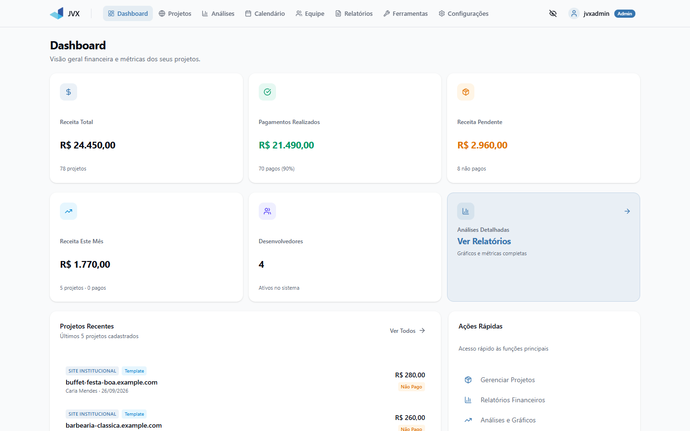
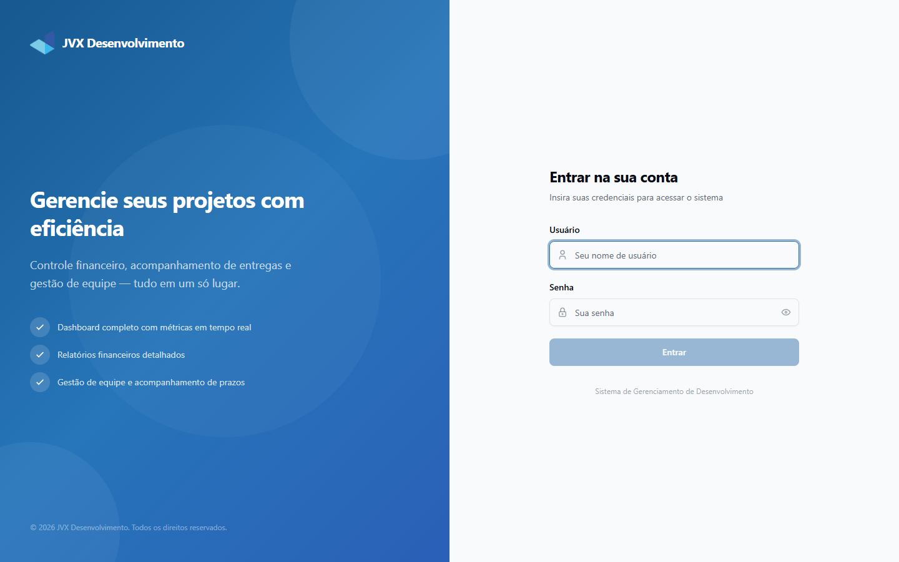
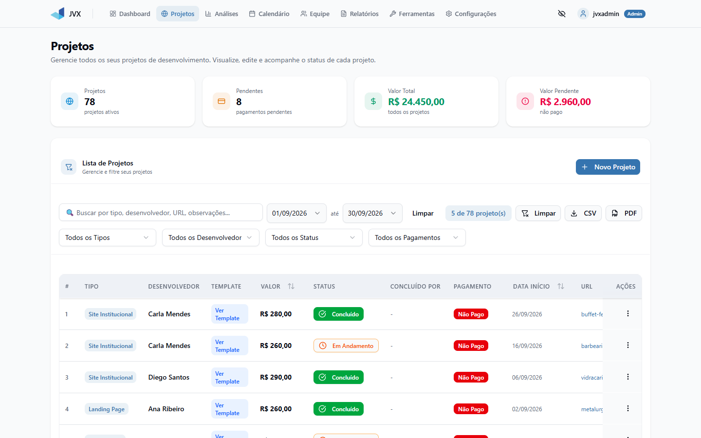
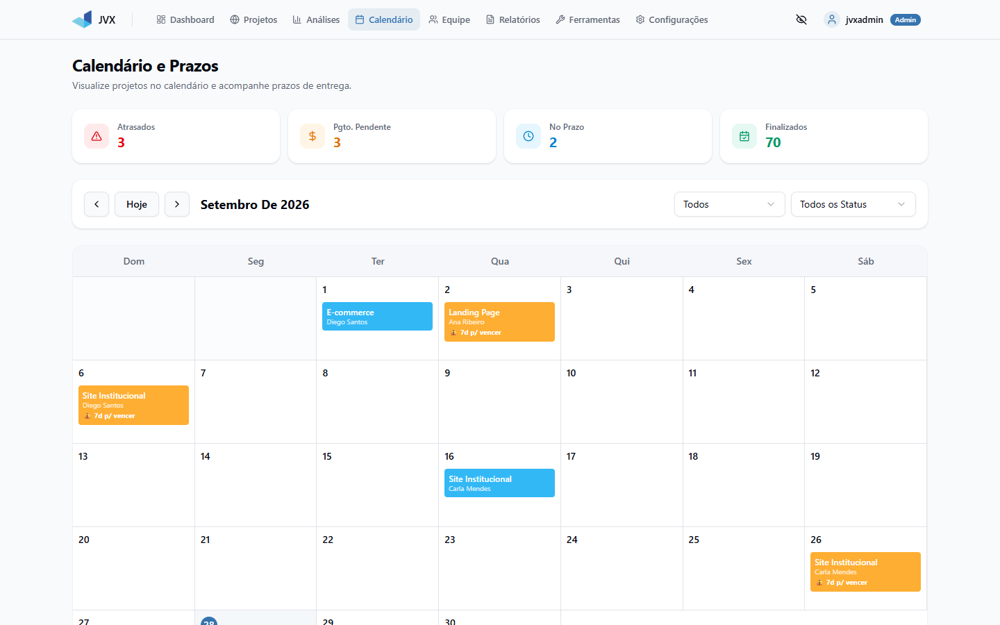
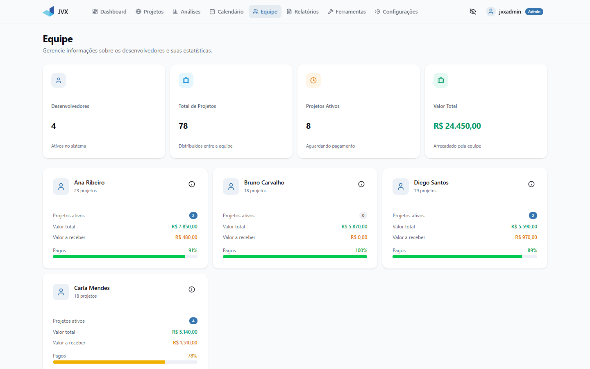
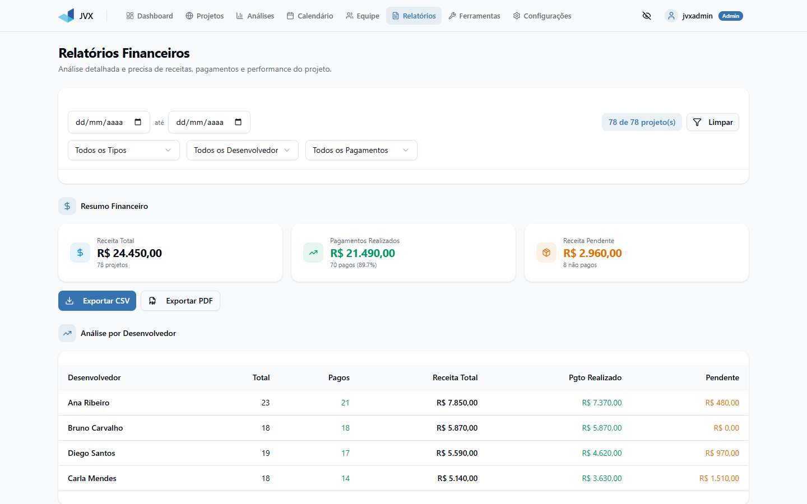
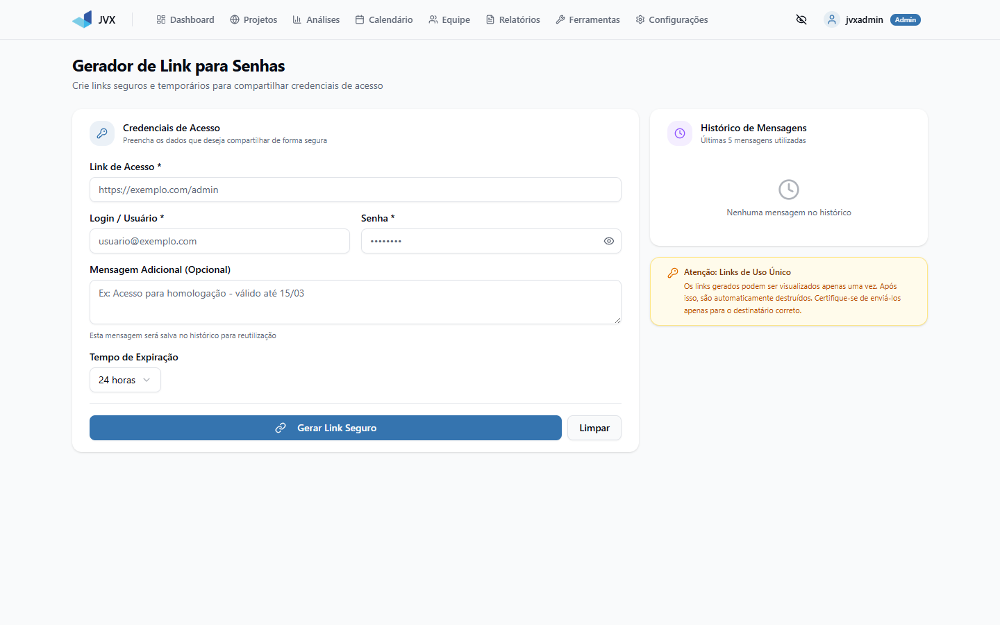
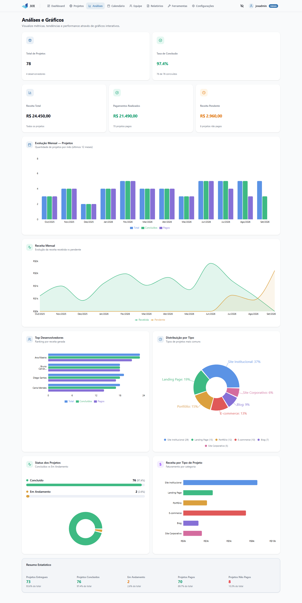
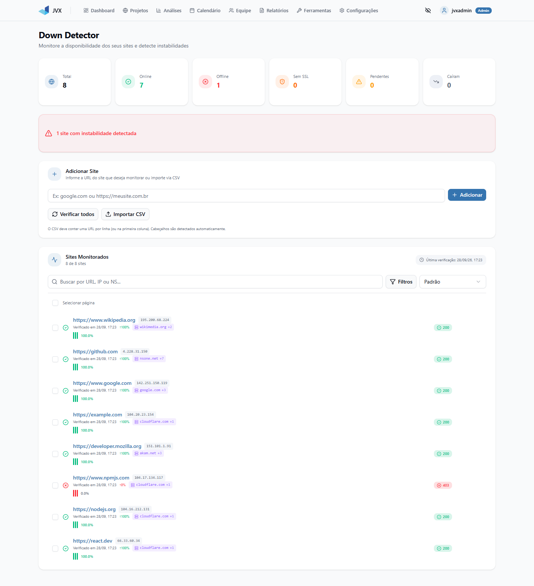

# JVX Desenvolvimento

Sistema web interno para gestão de projetos de desenvolvimento de sites. A aplicação centraliza trabalhos, entregas, pagamentos, equipe, relatórios e ferramentas operacionais em um painel autenticado com perfis `master` e `standard`.



> Todas as capturas usam dados fictícios gerados pelo script de seed.

## Visão geral

O projeto combina um frontend em React + TypeScript (Vite) com uma API Node.js/Express e persistência em MySQL. A autenticação é feita por JWT com sessão única por usuário, e as rotas administrativas são restritas ao perfil `master`. O fluxo principal é cadastrar trabalhos, acompanhar entrega e pagamento de cada desenvolvedor e consolidar os números em dashboards e relatórios exportáveis.

## Funcionalidades

- Dashboard com métricas financeiras, operacionais e de desempenho por desenvolvedor.
- Gestão de trabalhos/sites com filtros, ordenação, status de entrega e de pagamento.
- Importação de trabalhos via CSV e exportação de relatórios em PDF.
- Relatórios por período, desenvolvedor e tipo de site.
- Calendário de entregas.
- Cadastro da equipe com dados de contato e pagamento.
- Gestão de usuários e permissões (`master` / `standard`).
- Gerador de links de uso único para compartilhar credenciais (via OneTimeSecret).
- Down Detector para monitorar disponibilidade, SSL e DNS de sites.
- Opção para ocultar valores financeiros na interface.

## Telas

| Login | Projetos |
| --- | --- |
|  |  |
| **Calendário** | **Equipe** |
|  |  |
| **Relatórios** | **Gerador de links seguros** |
|  |  |

<details>
<summary><strong>Análises e gráficos</strong></summary>



</details>

<details>
<summary><strong>Down Detector</strong></summary>



</details>

## Estrutura do projeto

```text
.
|-- database/                 # Scripts SQL e CSV de exemplo (dados fictícios)
|-- docs/                     # Documentação técnica e de segurança
|-- scripts/
|   |-- database/             # Teste de conexão, seed e manutenção do banco
|   |-- import/               # Importação direta de CSV
|   `-- test/                 # Testes de integração da API
|-- src/
|   |-- __tests__/            # Testes unitários (Vitest)
|   |-- assets/               # Imagens e favicon
|   |-- components/           # UI, dashboard, dialogs, relatórios e skeletons
|   |-- contexts/             # Auth, trabalhos e ocultação de valores
|   |-- ferramentas/          # Gerador de links seguros e Down Detector
|   |-- lib/                  # Cliente da API, constantes, PDF e utilitários
|   |-- pages/                # Páginas roteadas
|   `-- types/                # Tipos compartilhados
|-- server/                   # Módulos do backend (proteção SSRF)
|-- server.js                 # API Express
|-- .env.example              # Modelo de variáveis de ambiente
|-- package.json
`-- README.md
```

Mais detalhes em [docs/ESTRUTURA_PROJETO.md](docs/ESTRUTURA_PROJETO.md).

## Como executar

Pré-requisitos: Node.js 18+, pnpm e MySQL 8 (ou MariaDB compatível).

```bash
pnpm install
cp .env.example .env          # defina JWT_SECRET (32+ caracteres) e os dados do banco
mysql -u root -p < database/database-init-clean.sql
pnpm run db:seed              # opcional: ~80 projetos fictícios para demonstração
```

Em dois terminais:

```bash
pnpm run server               # API em http://localhost:3001
pnpm run dev                  # Frontend em http://localhost:5173
```

Usuários de demonstração (apenas para uso local):

| Usuário | Senha | Perfil |
| --- | --- | --- |
| `jvxadmin` | `admin123` | master (criado pelo script SQL) |
| `ana.dev` | `dev123` | standard (criado pelo seed) |
| `bruno.dev` | `dev123` | standard (criado pelo seed) |

Troque essas senhas antes de expor o sistema em qualquer rede.

Outros scripts úteis:

```bash
pnpm run lint                 # ESLint
pnpm run test                 # Testes unitários
pnpm run build                # Type-check e build de produção
pnpm run test:api             # Testes de integração (API rodando)
pnpm run db:test              # Verifica conexão e tabelas do MySQL
```

## Stacks

- React 19
- TypeScript
- Vite
- Tailwind CSS 4
- Radix UI / shadcn/ui
- Recharts
- Node.js
- Express 5
- MySQL (mysql2)
- JWT + bcrypt
- Helmet e express-rate-limit
- Vitest
- pnpm

## Hook para portfolio

**Categoria do projeto:** Sistema web / Painel administrativo

**Breve descrição:** Sistema full stack para gestão de projetos de desenvolvimento web, com controle de entregas, pagamentos da equipe, relatórios financeiros e ferramentas operacionais internas.

**Contexto:** O projeto foi desenvolvido para substituir planilhas de acompanhamento de uma operação de desenvolvimento de sites, centralizando o histórico de trabalhos, os pagamentos por desenvolvedor e os indicadores de produtividade em uma única aplicação com controle de acesso.

**Resultado:** Uma aplicação React + Express + MySQL com autenticação JWT, perfis de acesso, dashboards, importação de CSV, exportação de relatórios em PDF e ferramentas de apoio, como geração de links seguros para credenciais e monitoramento de sites.

**Destaques:**

- API REST em Express com JWT em cookie HttpOnly/SameSite, sessão única por usuário e migração automática de hashes legados para bcrypt.
- Controle de acesso por perfil (`master` / `standard`) no frontend e no backend.
- Dashboards e relatórios com Recharts e exportação para PDF.
- Importação em lote de trabalhos via CSV.
- Down Detector com checagem de status HTTP, SSL e DNS, protegido contra SSRF (bloqueio de redes internas e DNS rebinding).
- Integração com OneTimeSecret para compartilhar credenciais com links de uso único.
- Testes unitários com Vitest e suíte de integração da API.

**Stacks:**

- React
- TypeScript
- Vite
- Tailwind CSS
- Node.js
- Express
- MySQL
- JWT

**Imagens:**

- `docs/images/dashboard.png`
- `docs/images/login.png`
- `docs/images/projetos.png`
- `docs/images/analises.png`
- `docs/images/calendario.png`
- `docs/images/equipe.png`
- `docs/images/relatorios.png`
- `docs/images/down-detector.png`
- `docs/images/gerador-links.png`
